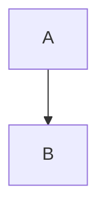
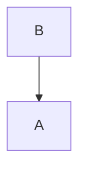
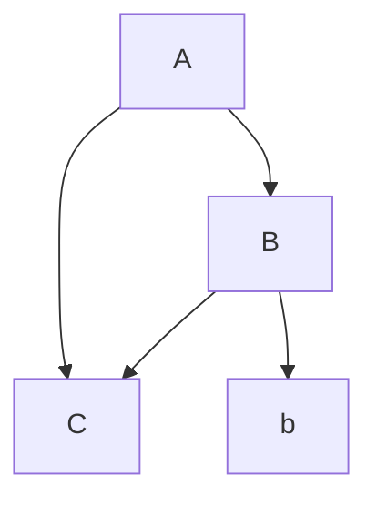

# Graph Generator GUI Application using Mermaid

This project is a graphical user interface **(GUI)** application built in **Kotlin** using **Compose for Desktop** which is designed to generate and visualize graphs based on user input.
Application supports only directed graph type.

## Requirements
- JDK 21 or lower
- In order to run the application, user need mermaid CLI installed on their system.
You can install it using npm:

    ```bash
    npm install -g @mermaid-js/mermaid-cli
    ```
    more details can be found [here](https://github.com/mermaid-js/mermaid-cli)

# Getting Started
1. Ensure you have JDK 21 or lower installed
2. Install Mermaid CLI: `npm install -g @mermaid-js/mermaid-cli`
3. ```bash
    # Clone the repository
    git clone https://github.com/VladGusiev/mermaid_diagram_generator/tree/main/src
    cd mermaid_diagram_generator/
    
    # Build the application
    ./gradlew build
    
    # Run the application
    ./gradlew run
    ```

# How to use
In this section will be described how to use the application.
## Graph Notation
Application uses a simple graph notation to define the graph structure. The notation is as follows:

`A -> B`
will create a simple directed graph with A as the source node and B as the target node.

Also reversed arrow is supported:

`A <- B`
will create a simple directed graph with A as the target node and B as the source node.


### Other rules:
- Only one connection per line is allowed.
- No other connection symbols besides `->` or `<-` are allowed.
- No whitespaces are allowed in the vertices notation

### Example
Input:
```
A -> B
A -> C
C <- B
B -> b
```
Output:


# Features
- User-friendly GUI for easy interaction.
- Automatic graph refresh based on user input.
- responsive application even with large graphs.
- Shows all unique vertices in the graph.
    - Allows user to disable/enable vertices.
    - Search of vertices by name.
    - While toggling vertices, the graph will be updated automatically.
- Caching of graphs data for faster access.
- Error detection for invalid input and more.
- Zooming of the graph.

## Error Handling
The application provides error messages when:
- Invalid connection syntax is used
- Vertices are improperly formatted
- The Mermaid CLI encounters issues processing the graph

## Performance Optimizations
- Diagram caching to prevent regenerating identical graphs
- Input debouncing to reduce processing during rapid typing
- Efficient vertex toggling without unnecessary reprocessing

# Code Structure
- `src/main/kotlin/model` - Contains data classes and error handling models for the application.
- `src/main/kotlin/ui` - Contains the UI components and Compose functions for the GUI.
- `src/main/kotlin/DiagramGenerator.kt` 
  - This class handles the actual diagram generation process:
  - Creates temporary files for Mermaid input/output
  - Executes the Mermaid CLI with appropriate parameters
  - Handles CLI timeouts and errors gracefully
  - Returns the path to the generated PNG image
  - Includes utility to verify Mermaid CLI installation
- `src/main/kotlin/DiagramViewModel.kt` - Core business logic that manages application state, processes user input, and coordinates between the UI and diagram generation. It implements:
  - Parsing graph connections
  - Managing vertex states (active/inactive)
  - Caching generated diagrams for performance
  - Debouncing input to prevent excessive diagram generation
- `src/main/kotlin/Main.kt` - Application entry point that initializes the Compose UI and launches the application window.

### Common Issues

- **Cannot build the application** - Ensure you have the correct JDK version and mermaid CLI installed and configured correctly in PATH
- **Error: Mermaid CLI not found** - Ensure Mermaid CLI is properly installed and available in your PATH
- **Output graph file was not generated** - Check if the input format is correct. If correct, consider lowering the number of lines in the input or vertices displayed.

# Limitations
- Maximum number of lines processed for graph generation is **~500**.